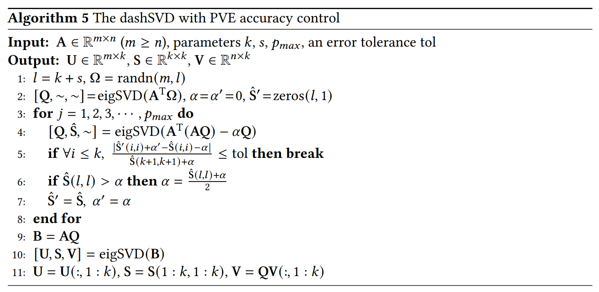

# DashSVD

[](https://github.com/My-laniaKeA/DashSVD.jl/actions/workflows/CI.yml?query=branch%3Amaster)

A Julia implementation of the dynamic shifts-based randomized SVD (dashSVD) with PVE accuracy control.


## Algorithm




## Interface

Parameters:

* `A`: the input matrix of size (m, n)
* `k`:  the target rank of truncated SVD, k ≤ min(m,n)
* `p_max`:  the upper bound of power parameter `p`, default = 1000
* `s`: the oversampling parameter, **min(m,n) ≥ k + s**, default = `k/2`
* `tol`: the error tolerance for PVE, default = 1e-2

Returns:

* `U`: the matrix of size (m, k) containing the first `k` left singular vectors of `A`
* `S`: the vector of size (k, ) containing the `k` largest singular values of `A` in **ascending** order.
* `V`: the matrix of size (n, k) containing the first `k` right singular vectors of `A`


## Example

```julia
julia> using DashSVD
julia> A = randn(10, 6)
julia> U, S, V = dash_svd(A, 2)
```

